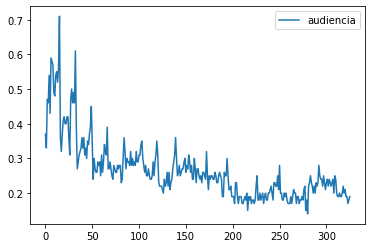
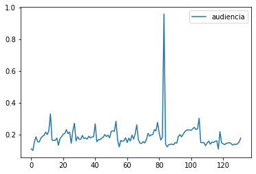
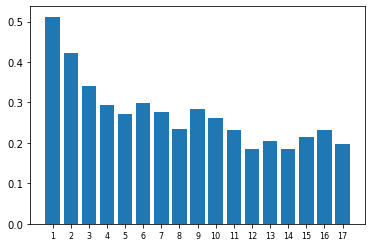
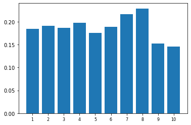

# Ejercicio: Análisis de audiencias televisivas
**Autor**: José A. Troyano.   **Revisores**: Fermín Cruz, Mariano González, Carlos G. Vallejo, José C. Riquelme, Beatriz Pontes, Toñi Reina.   **Última modificación:** 24/09/2024

En este ejercicio trabajaremos con datos de audiencias televisivas, en concreto con los datos de audiencia de diferentes ediciones de varios programas como _MasterChef_, _MasterChef Celebrity_ o _Gran Hermano_. Obtendremos una serie de indicadores y gráficas que nos permitirán analizar la evolución de la audiencia de un programa televisivo a lo largo del tiempo. 

Para analizar los datos de audiencias partiremos de archivos en formato csv (valores separados por coma), en los que tenemos almacenada la información de las audiencias del programa concreto a analizar. Estos archivos csv estarán compuestos por distintas líneas con dos datos separados por comas: la edición a la que pertence el dato de audiencia, y el porcentaje de audiencia (en tanto por uno) obtenido en la emisión concreta (o _share_). Además, los datos aparecerán ordenados por número de emisión. Por ejemplo, si analizamos las 5 primeras líneas del fichero <code>MasterChef.csv</code>, que contiene los datos siguientes:

<pre>
1, .11
1, .1
1, .155
1, .186
1, .155
</pre>

podemos deducir que el primer programa de la primera edición de _MasterChef_ tuvo un _share_ del 11%, el segundo el 10%, el tercero el 15.5%, y así sucesivamente. 

Este ejercicio nos servirá para ilustrar, sobre un proyecto sencillo, los pasos más comunes de la mayor parte de los ejercicios que haremos a lo largo del curso, ya que para explotar estos datos, estructuraremos nuestro programa en varios tipos de funciones que tendrán una responsabilidad única:

### Funciones de carga de datos. 

Lo primero que tenemos que hacer, si queremos hacer operaciones con los datos almacenados en el archivo, es cargar los datos en la memoria del ordenador. Además, debe tenerse en cuenta que, cuando leemos los datos de un fichero, siempre se leen en formato cadena. La responsabilidad, por tanto, de las funciones de este grupo, será cargar los datos, y hacer las conversiones de tipos necesarias para poder operar con los datos de manera adecuada.

### Funciones de transformación y filtrado.

Una vez tenemos los datos cargados y con los tipos adecuados, tendremos que operar con ellos. Las funciones de este bloque se encargan de realizar las operaciones correspondientes. Cada función tiene una responsabilidad y devuelve un valor. Las funciones de este grupo NO muestran los resultados por la consola con print, ya que su responsabilidad es hacer el cálculo o la operación correspondiente, pero no mostrarle al usuario el resultado.

### Funciones de visualización.

Una vez que hemos hecho las operaciones o cálculos, las funciones de este grupo se encargan de mostrar los resultados, que podrán ser textuales o gráficos. Para mostrar los resultados usaremos tanto módulos de la librería estándar, como paquetes externos, como por ejemplo <code>matplotlib</code> para la generación de gráficas. 

---

**Se proporciona la solución de casi todos los apartados**, que el alumno puede trasladar a los correspondientes módulos ``audiencias.py`` (para implementar las distintas funciones) y ``audiencias_test.py`` (para implementar las pruebas de dichas funciones). Cree estos módulos en una carpeta ``src``.

## 0. Importaciones y definición de una namedtuple

Estas son las correspondientes instrucciones de importación para las dependencias de nuestro ejercicio:

```python
import csv   # Para leer los csv de datos
from matplotlib import pyplot as plt   # Para mostrar gráficas, importamos matplotlib.pyplot, renombrándolo como plt
from collections import namedtuple     # Para definir tuplas con nombre
```

Para que el código sea más legible, vamos a definir un nuevo tipo de tupla con nombre llamado `Audiencias`. Este nuevo tipo se define en base a una tupla de dos campos. Al primer cambo de la tupla se le dará el nombre `edicion` y al segundo el nombre `share`. La definición del nuevo tipo se realiza mediante la siguiente sentencia.

```python
Audiencia = namedtuple ("Audiencia", "edicion, share")
```

## 1. Carga de datos

Tomaremos los datos de un fichero de entrada llamado <code>GH.csv</code>, en el que se encuentran las audiencias de las distintas ediciones del programa televisivo "Gran Hermano" desde la primera edición hasta la número 17.

Cada línea del fichero de entrada se corresponde con la audiencia de un
programa, y contiene dos informaciones: 
- La edición a la que pertenece el programa
- El _share_ (porcentaje de la audiencia que vio ese programa concreto) 

No hay información de fecha, pero las líneas del fichero mantienen el orden cronológico en el que fueron emitidos los correspondientes programas. Estas son las primeras líneas del fichero de entrada:

<pre>
    1,0.37
    1,0.33
    1,0.47
    1,0.46
    1,0.54
    1,0.43
    1,0.59
    1,0.58
</pre>

La primera función que implementaremos será la de lectura. Será la encargada de leer los datos del fichero de entrada y cargarlos en una estructura en memoria. La estructura más apropiada para los datos será una _lista de tuplas de tipo Audiencias_. Una lista porque tenemos como entrada una secuencia de audiencias, y _de tuplas_ porque cada audiencia tiene dos informaciones (edición y _share_), que se corresponden con los dos campos que hemos definido en el tipo _Audiencias_. 


```python
def lee_Audiencia(fichero):
    ''' 
    Lee el fichero de entrada y devuelve una lista de audiencias
    
    ENTRADA: 
       @param fichero: nombre del fichero
       @type fichero:  str
    SALIDA: 
       @return: lista de audiencias
       @rtype: [Audiencia(int, float)] 

    Cada línea del fichero se corresponde con la audiencia de un programa,
    y se representa con una tupla con los siguientes valores:
        - edición
        - audiencia
    Hay que transformar la entrada (cadenas de caracteres) en valores numéricos
    para que puedan ser procesados posteriormente.
    '''
    audiencias=[]
    with open(fichero, encoding='utf-8') as f:
        # Se crea un objeto lector (un iterator) que separará los valores por comas 
        lector = csv.reader(f)
        for edicion, share in lector:
            edicion = int(edicion)
            share = float(share)
            audiencias.append(Audiencia(edicion, share))
    return audiencias
```

Para probar la función anterior, puede añadir este código al módulo ``audiencias_test.py``:

```python
from audiencias import * 

def test_lee_audiencias (audiencias, nombre_programa):
    print(f"Audiencias del programa {nombre_programa}:")
    print(audiencias[:20])

def main():
    '''
    Función principal
    '''
    #test de la función de lectura de ficheros--------------------------------------------------------------- 
    audiencias_gh = lee_audiencias('./data/GH.csv')
    test_lee_audiencias(audiencias_gh, "Gran Hermano")

    audiencias_masterchef = lee_audiencias('./data/MasterChef.csv')
    test_lee_audiencias(audiencias_masterchef, "Master Chef")

if __name__=="__main__":
    main()
```

La salida esperada de la ejecución del test es esta:

    Audiencias del programa Gran Hermano:
    [Audiencia(1, 0.37), Audiencia(1, 0.33), Audiencia(1, 0.47), Audiencia(1, 0.46), Audiencia(1, 0.54), Audiencia(1, 0.43), Audiencia(1, 0.59), Audiencia(1, 0.58), Audiencia(1, 0.57), Audiencia(1, 0.49), Audiencia(1, 0.48), Audiencia(1, 0.54), Audiencia(1, 0.55), Audiencia(1, 0.52), Audiencia(1, 0.56), Audiencia(1, 0.71), Audiencia(2, 0.36), Audiencia(2, 0.32), Audiencia(2, 0.37), Audiencia(2, 0.41)]

    Audiencias del programa MasterChef:
    [Audiencia(1, 0.11), Audiencia(1, 0.1), Audiencia(1, 0.155), Audiencia(1, 0.186), Audiencia(1, 0.155), Audiencia(1, 0.153), Audiencia(1, 0.177), Audiencia(1, 0.189), Audiencia(1, 0.195), Audiencia(1, 0.216), Audiencia(1, 0.2), Audiencia(1, 0.224), Audiencia(1, 0.331), Audiencia(2, 0.165), Audiencia(2, 0.163), Audiencia(2, 0.164), Audiencia(2, 0.178), Audiencia(2, 0.133), Audiencia(2, 0.176), Audiencia(2, 0.187)]


## 2. Funciones de transformación y filtrado

Una vez que hemos cargado los datos en una estructura en memoria, ya podemos comenzar a trabajar con ellos. Lo haremos con funciones que denominaremos de _transformación_ y _filtrado_. Con estas funciones podremos obtener información derivada de los datos originales _en crudo_, extraer un subconjunto de los datos en base a una _consulta_, y también podremos transformar los datos originales para obtener nuevas estructuras de datos que nos sirvan para resolver los problemas que nos plantee cada proyecto.

En este bloque queremos responder a tres preguntas distintas:
1. ¿Cuántas ediciones tiene el programa del que queremos analizar la audiencia?
2. ¿Qué audiencias han tenido todas las emisiones del programa de una edición concreta?
3. ¿Cuál es la media de _share_ en cada una de las ediciones?

Para responder a la primera pregunta, vamos a diseñar e implementar una función <code>calcula_ediciones</code>, que recibe como entrada la lista de tuplas de tipo _Audiencia_, y devuelve un entero que representa el número de ediciones del programa. Las siguientes celdas contienen la implementación y el test, respectivamente, de esta función:


```python
def calcula_ediciones(audiencias):
    ''' 
    Calcula el número de ediciones presentes en una lista de audiencias
    
    ENTRADA: 
       @param audiencias: lista de tuplas de audiencias
       @type audiencias: [Audiencia(int, float)]
    SALIDA: 
       @return: El número de ediciones del programa
       @rtype: int 

    Toma como entrada una lista de tuplas (edición, share) y produce como
    salida el número de ediciones del programa
    Solución utilizando una definición de audiencias por compresión
    '''
    # Calculamos el conjunto de ediciones presentes
    ediciones = set()
    for a in audiencias:
        ediciones.add(a.edicion)
    
    # Devolvemos el tamaño del conunto
    return len(ediciones)
```

Añada este código al módulo de pruebas:

```python
def test_calcula_ediciones(audiencias, nombre_programa):
    ediciones = calcula_ediciones(audiencias)
    print(f"Número de ediciones del programa {nombre_programa}: {ediciones}")

def main():
    (...)
    #test de la función calcula_ediciones--------------------------------------------------------------------
    test_calcula_ediciones(audiencias_gh, "Gran Hermano")
    test_calcula_ediciones(audiencias_masterchef, "Master Chef")
```
La salida esperada de la ejecución del test es esta:

    Número de ediciones del programa Gran Hermano: 17
    Número de ediciones del programa MasterChef: 10

---

Para responder a la segunda pregunta, vamos a diseñar e implementar una función que será _de filtrado_. Este tipo de funciones recuperan un subconjunto de los datos de entrada que cumplen una determinada condición. En concreto, implementaremos la función <code>filtra_por_ediciones</code>, que recupera solo aquellos registros de audiencias en los que la edición es una de las que se reciben como parámetro. 


```python
def filtra_por_ediciones(audiencias, ediciones):
    ''' 
    Selecciona las tuplas correspondientes a unas determinadas ediciones
    
    ENTRADA: 
       @param audiencias: lista de audiencias 
       @type audiencias: [Audiencia(int, float)]
       @param ediciones: lista de ediciones a seleccionar 
       @type ediciones: [int]
    SALIDA:
       @return: lista de tuplas de audiencias seleccionadas
       @rtype:  [Audiencia(int, float)]  
    '''
    filtradas = []
    for a in audiencias \
        if a.edicion in ediciones:
            filtradas.append(a)
    return filtradas
```

Añada este código al módulo de pruebas:

```python
def test_filtra_por_ediciones(audiencias, ediciones, nombre_programa):
    filtradas = filtra_por_ediciones(audiencias, ediciones)
    print(f"Los datos de las ediciones {ediciones} del programa {nombre_programa} son:\n {filtradas}")

def main():
    (...)         
    #test de la función filtra_por_ediciones-------------------------------------------------------------------
    test_filtra_por_ediciones(audiencias_gh, [1,2,3], "Gran Hermano")
    test_filtra_por_ediciones(audiencias_masterchef, [4,5], "Master Chef")
```
La salida esperada de la ejecución del test es esta:

    Audiencias de las tres primeras ediciones del programa Gran Hermano:
    [Audiencia(1, 0.37), Audiencia(1, 0.33), Audiencia(1, 0.47), Audiencia(1, 0.46), Audiencia(1, 0.54), Audiencia(1, 0.43), Audiencia(1, 0.59), Audiencia(1, 0.58), Audiencia(1, 0.57), Audiencia(1, 0.49), Audiencia(1, 0.48), Audiencia(1, 0.54), Audiencia(1, 0.55), Audiencia(1, 0.52), Audiencia(1, 0.56), Audiencia(1, 0.71), Audiencia(2, 0.36), Audiencia(2, 0.32), Audiencia(2, 0.37), Audiencia(2, 0.41), Audiencia(2, 0.42), Audiencia(2, 0.4), Audiencia(2, 0.4), Audiencia(2, 0.42), Audiencia(2, 0.42), Audiencia(2, 0.36), Audiencia(2, 0.31), Audiencia(2, 0.47), Audiencia(2, 0.5), Audiencia(2, 0.46), Audiencia(2, 0.49), Audiencia(2, 0.46), Audiencia(2, 0.61), Audiencia(3, 0.39), Audiencia(3, 0.27), Audiencia(3, 0.29), Audiencia(3, 0.31), Audiencia(3, 0.32), Audiencia(3, 0.33), Audiencia(3, 0.36), Audiencia(3, 0.33), Audiencia(3, 0.36), Audiencia(3, 0.31), Audiencia(3, 0.33), Audiencia(3, 0.3), Audiencia(3, 0.35), Audiencia(3, 0.34), Audiencia(3, 0.37), Audiencia(3, 0.39), Audiencia(3, 0.45)]
    
    Audiencias de las ediciones 5 y 6 del programa MasterChef:
    [Audiencia(4, 0.155), Audiencia(4, 0.169), Audiencia(4, 0.167), Audiencia(4, 0.178), Audiencia(4, 0.184), Audiencia(4, 0.2), Audiencia(4, 0.188), Audiencia(4, 0.196), Audiencia(4, 0.18), Audiencia(4, 0.22), Audiencia(4, 0.224), Audiencia(4, 0.221), Audiencia(4, 0.284), Audiencia(5, 0.167), Audiencia(5, 0.123), Audiencia(5, 0.163), Audiencia(5, 0.158), Audiencia(5, 0.161), Audiencia(5, 0.18), Audiencia(5, 0.15), Audiencia(5, 0.178), Audiencia(5, 0.16), Audiencia(5, 0.197), Audiencia(5, 0.172), Audiencia(5, 0.206), Audiencia(5, 0.261)]
    
---

Para responder a la tercera pregunta, vamos a implementar una función _de transformación_. Con este tipo de funciones construiremos nuevas estructuras de datos a partir de los datos de entrada, que nos darán otras perspectivas de los mismos (aplicando, por ejemplo, algún tipo de función de resumen o agregación). Así, implementaremos la función <code>medias_por_ediciones</code>, que tomará como entrada una lista de tuplas de tipo _Audiencia_ y devolverá un diccionario en el que las claves son ediciones y los valores son las medias de _share_ de cada edición.

En algunos casos, la operación a realizar puede ser compleja, y conviene usar funciones auxiliares que ayuden a modularizar y estructurar mejor el código. Así que para implementar <code>medias_por_ediciones</code>, vamos a definir una función auxiliar que se encargue de agrupar los datos por ediciones, para luego poder calcular la media. Esta función auxiliar se llama <code>agrupa_share_por_ediciones</code> y se encarga de obtener un diccionario en el que las claves sean las ediciones, y los valores sean listas de números reales con los datos de _share_ de los programas de esa edición.

```python
def agrupa_share_por_ediciones(audiencias):
    '''
    Para una lista de tuplas de audiencia, agrupa los valores de share por edición en un diccionario.

    ENTRADA:
    @param audiencias: lista de tuplas (edicion, share) con las audiencias de un programa de televisión
    @type audiencias: [Audiencia(int, float)]
    SALIDA:
    @return: Un diccionario en el que las claves son las ediciones y los valores son listas de shares de cada edición
    @rtype: {int:[float]}
    '''
    res = dict() # Crea diccionario vacío, también se puede hacer res = {}
    for a in audiencias:                
        if a.edicion in res: 
            # Si la edición ya está en el diccionario
            res[a.edicion].append(a.share)  # Se añade el share a la lista de shares asociada a esa edición
        else: 
            # Si la edición no está en el diccionario
            res[a.edicion] = [a.share]  # Se rea una nueva lista con el share y se asocia a la edición
    return res
```

Añada este código al módulo de pruebas:

```python
def test_agrupa_por_ediciones(audiencias, nombre_programa):
    dicc = agrupa_por_ediciones(audiencias)
    print(f"Agrupación por ediciones del programa {nombre_programa}: \n{dicc}")

def main():
    (...)
    #test de la función agrupa_por_ediciones-------------------------------------------------------------------
    test_agrupa_por_ediciones(audiencias_gh, "Gran Hermano")
    test_agrupa_por_ediciones(audiencias_masterchef, "Master Chef")
```

La salida esperada de la ejecución del test es esta:

    Agrupación por ediciones de las audiencias del programa Gran Hermano:
    {1: [0.37, 0.33, 0.47, 0.46, 0.54, 0.43, 0.59, 0.58, 0.57, 0.49, 0.48, 0.54, 0.55, 0.52, 0.56, 0.71], 2: [0.36, 0.32, 0.37, 0.41, 0.42, 0.4, 0.4, 0.42, 0.42, 0.36, 0.31, 0.47, 0.5, 0.46, 0.49, 0.46, 0.61], 3: [0.39, 0.27, 0.29, 0.31, 0.32, 0.33, 0.36, 0.33, 0.36, 0.31, 0.33, 0.3, 0.35, 0.34, 0.37, 0.39, 0.45], 4: [0.34, 0.24, 0.3, 0.27, 0.26, 0.26, 0.29, 0.28, 0.29, 0.25, 0.31, 0.26, 0.29, 0.34, 0.32, 0.31, 0.39], 5: [0.27, 0.27, 0.29, 0.27, 0.25, 0.24, 0.28, 0.27, 0.26, 0.26, 0.28, 0.27, 0.28, 0.28, 0.23, 0.24, 0.3, 0.36], 6: [0.32, 0.27, 0.3, 0.29, 0.29, 0.28, 0.32, 0.28, 0.3, 0.28, 0.29, 0.28, 0.32, 0.29, 0.29, 0.31, 0.31, 0.34], 7: [0.35, 0.3, 0.28, 0.26, 0.28, 0.25, 0.25, 0.27, 0.25, 0.24, 0.24, 0.25, 0.29, 0.25, 0.29, 0.31, 0.35], 8: [0.31, 0.23, 0.22, 0.22, 0.22, 0.21, 0.2, 0.24, 0.22, 0.23, 0.26, 0.22, 0.26, 0.21, 0.23, 0.24, 0.27], 9: [0.29, 0.31, 0.36, 0.3, 0.25, 0.26, 0.28, 0.25, 0.26, 0.27, 0.27, 0.29, 0.3, 0.26, 0.28, 0.27, 0.31], 10: [0.29, 0.26, 0.28, 0.24, 0.24, 0.3, 0.27, 0.23, 0.27, 0.27, 0.25, 0.24, 0.25, 0.23, 0.26, 0.26, 0.25, 0.24, 0.32], 11: [0.25, 0.21, 0.25, 0.24, 0.25, 0.25, 0.24, 0.24, 0.26, 0.25, 0.23, 0.23, 0.25, 0.26, 0.25, 0.24, 0.19, 0.19, 0.26, 0.25, 0.25, 0.3, 0.25, 0.21, 0.21, 0.22, 0.19, 0.19, 0.19, 0.17, 0.23], 12: [0.23, 0.19, 0.17, 0.19, 0.19, 0.19, 0.17, 0.17, 0.18, 0.19, 0.18, 0.2, 0.15, 0.19, 0.18, 0.19, 0.17, 0.18, 0.18, 0.17, 0.18, 0.22], 13: [0.25, 0.18, 0.18, 0.2, 0.18, 0.19, 0.2, 0.17, 0.19, 0.2, 0.18, 0.18, 0.2, 0.2, 0.21, 0.22, 0.2, 0.18, 0.23, 0.23, 0.22, 0.22, 0.25, 0.21, 0.28, 0.2, 0.2, 0.18, 0.18, 0.2], 14: [0.19, 0.2, 0.18, 0.17, 0.17, 0.17, 0.19, 0.17, 0.19, 0.21, 0.2, 0.2, 0.17, 0.19, 0.19, 0.17, 0.18, 0.18, 0.19, 0.18, 0.21], 15: [0.22, 0.15, 0.18, 0.14, 0.22, 0.23, 0.25, 0.23, 0.22, 0.2, 0.22, 0.2, 0.23, 0.22, 0.23, 0.28], 16: [0.25, 0.24, 0.24, 0.22, 0.25, 0.23, 0.21, 0.23, 0.24, 0.22, 0.24, 0.23, 0.22, 0.23, 0.24, 0.2, 0.25], 17: [0.24, 0.2, 0.19, 0.19, 0.2, 0.19, 0.19, 0.2, 0.22, 0.2, 0.21, 0.19, 0.19, 0.17, 0.18, 0.19]}
    
    Agrupación por ediciones de las audiencias del programa MasterChef:
    {1: [0.11, 0.1, 0.155, 0.186, 0.155, 0.153, 0.177, 0.189, 0.195, 0.216, 0.2, 0.224, 0.331], 2: [0.165, 0.163, 0.164, 0.178, 0.133, 0.176, 0.187, 0.203, 0.207, 0.231, 0.206, 0.216, 0.145, 0.224, 0.271], 3: [0.16, 0.186, 0.171, 0.171, 0.195, 0.175, 0.179, 0.172, 0.19, 0.179, 0.185, 0.187, 0.268], 4: [0.155, 0.169, 0.167, 0.178, 0.184, 0.2, 0.188, 0.196, 0.18, 0.22, 0.224, 0.221, 0.284], 5: [0.167, 0.123, 0.163, 0.158, 0.161, 0.18, 0.15, 0.178, 0.16, 0.197, 0.172, 0.206, 0.261], 6: [0.168, 0.146, 0.144, 0.156, 0.147, 0.168, 0.208, 0.191, 0.198, 0.2, 0.231, 0.224, 0.277], 7: [0.21, 0.166, 0.183, 0.96, 0.141, 0.123, 0.136, 0.139, 0.14, 0.136, 0.149, 0.146, 0.188], 8: [0.2, 0.186, 0.202, 0.218, 0.227, 0.23, 0.229, 0.227, 0.237, 0.246, 0.232, 0.237, 0.303], 9: [0.15, 0.149, 0.15, 0.13, 0.147, 0.159, 0.14, 0.153, 0.15, 0.158, 0.161, 0.109, 0.219], 10: [0.149, 0.142, 0.137, 0.145, 0.147, 0.15, 0.143, 0.134, 0.14, 0.138, 0.142, 0.153, 0.178]}
    

---

Ahora podemos implementar la función ``medias_por_ediciones``, que calcula la media de share por cada edición:


```python
def medias_por_ediciones(audiencias):
    ''' 
    Calcula la media de audiencia para cada edición
    
    ENTRADA: 
       @param audiencias: lista de audiencias 
       @type audiencias: [Audiencia(int, float)]
    SALIDA:
       @return: medias de audiencia por cada edición
       @rtype: {int: float}

    Toma como entrada una lista de tuplas (edición, share) y produce como
    salida un diccionario en el que las claves son las ediciones y los
    valores son las medias de audiencia de cada edición.
    '''    
    share_por_ediciones = agrupa_share_por_ediciones(audiencias)
    medias = dict()
    for edicion, lista_shares in share_por_ediciones.items():        
        medias[edicion] = sum(lista_shares) / len(lista_shares)
    return medias
```
Añada este código al módulo de pruebas:

```python
def test_medias_por_ediciones(audiencias, nombre_programa):
    dicc = medias_por_ediciones(audiencias)
    print(f"La media por ediciones del programa {nombre_programa} es: \n{dicc}")

def main():
    (...)
    #test de la función media_por_ediciones--------------------------------------------------------------------
    test_medias_por_ediciones(audiencias_gh, "Gran Hermano")
    test_medias_por_ediciones(audiencias_masterchef, "Master Chef")
```

La salida esperada de la ejecución del test es esta:

    Media de audiencias por ediciones del programa Gran Hermano:
    {1: 0.5118750000000001, 2: 0.4223529411764706, 3: 0.3411764705882353, 4: 0.29411764705882354, 5: 0.2722222222222223, 6: 0.29777777777777775, 7: 0.27705882352941175, 8: 0.23470588235294115, 9: 0.2829411764705882, 10: 0.2605263157894737, 11: 0.2322580645161291, 12: 0.18454545454545457, 13: 0.2036666666666667, 14: 0.18571428571428572, 15: 0.21375000000000005, 16: 0.23176470588235296, 17: 0.196875}
    
    Media de audiencias por ediciones del programa MasterChef:
    {1: 0.1839230769230769, 2: 0.19126666666666672, 3: 0.186, 4: 0.19738461538461538, 5: 0.1750769230769231, 6: 0.1890769230769231, 7: 0.2166923076923077, 8: 0.2287692307692308, 9: 0.1519230769230769, 10: 0.14599999999999996}
    

## 3. Funciones de visualización

En este último bloque, vamos a responder a preguntas concretas proporcionando resultados gráficos que le permitan al usuario interpretar mejor los resultados del proyecto. En concreto, vamos a responder a las siguientes preguntas:

4. ¿Cómo ha ido evolucionando la audiencia del programa en las distintas ediciones a lo largo del tiempo?
5. ¿Cuál es la media de _share_ en cada una de las ediciones? (date cuenta de que esta pregunta es la misma que la pregunta 3 del bloque anterior, pero ahora vamos a ver los resultados de forma gráfica)

En Python, el paquete más usado para generar gráficas es <code>matplotlib</code>. Haciendo uso de ``matplotlib.pyplot``, que hemos renombrado en la sección de importaciones como ``plt``, implementaremos la función de visualización <code>muestra_evolucion_audiencias</code>. Esta función toma como entrada una lista de tuplas de tipo _Audiencia_ y genera una gráfica con la evolución de los _shares_ a lo largo del tiempo.

```python
def muestra_evolucion_audiencias(audiencias, nombre_programa):
    ''' 
    Genera una curva con la evolución de las audiencias
    
    ENTRADA: 
       @param audiencias: lista de audiencias
       @type audiencias: [Audiencia(int, float)]
       @param nombre_programa: Nombre del programa
       @type nombre_programa: str

    SALIDA EN CONSOLA:
       - gráfica con la evolución de los shares a lo largo del tiempo   
    
    '''
    # Nos quedamos sólo con los valores de share
    shares = []
    for a in audiencias:
        shares.append(a.share)
    
    # Componemos y visualizamos la gráfica
    plt.title(f"Evolución de audiencias del programa {nombre_programa}")    
    plt.plot(shares, label='audiencia')
    plt.legend()
    plt.show()
```

Añada este código al módulo de pruebas:
```python
def test_muestra_evolucion_audiencias(audiencias, nombre_programa):
    print(f"Evolución de las audiencias de {nombre_programa}")
    muestra_evolucion_audiencias(audiencias, nombre_programa)

def main():
    (...)
    #test de la función muestra_evolucion_audiencias------------------------------------------------------------
    test_muestra_evolucion_audiencias(audiencias_gh, "Gran Hermano")
    test_muestra_evolucion_audiencias(audiencias_masterchef, "Master Chef")
```

La salida esperada de la ejecución del test es esta:






---

Para responder a la última pregunta implementaremos la función <code>muestra_medias_por_ediciones</code>. Esta función, que también toma como entrada una lista de tuplas de tipo _Audiencia_, se apoyará en la función <code>medias_por_ediciones</code> para calcular un diccionario con las medias de _share_ de cada edición. Los valores de este diccionario se mostrarán en un diagrama de barras en el que en el eje _X_ se representarán las ediciones, y la media de los _shares_ se corresponderá con la altura de las barras.


```python
def muestra_medias_por_ediciones(audiencias, nombre_programa):
    ''' Genera un diagrama de barras con la media de audiencia de cada edición
    
    ENTRADA: 
       @param audiencias: lista de audiencias
       @type audiencias: [Audiencia(int, float)]
       @param nombre_programa: Nombre del programa
       @type nombre_programa: str
    SALIDA EN CONSOLA:
       - gráfica con las medias por cada edición
    '''
    
    # Calculamos las medias por cada edición
    dicc_medias = medias_por_ediciones(audiencias)

    # Calculamos la lista de ediciones
    ediciones = sorted(dicc_medias.keys())

    # Generamos una lista de medias con el mismo orden que las ediciones
    lista_medias = []
    for e in ediciones:
        lista_medias.append(dicc_medias[e])

    # Componemos y visualizamos la gráfica
    plt.title(f"Medias de shares por edición del programa {nombre_programa}")
    plt.xlabel("ediciones")
    plt.ylabel("medias")

    plt.bar(ediciones, lista_medias)
    plt.xticks(ediciones, ediciones, fontsize=8)
    plt.show()
```


Añada este código al módulo de pruebas:
```python
def test_muestra_medias_por_ediciones(audiencias, nombre_programa):
    print(f"Media de las audiencias de {nombre_programa} por edición")
    muestra_medias_por_ediciones(audiencias, nombre_programa)

def main():
    (...)
    #test de la función muestra_evolucion_audiencias------------------------------------------------------------
    test_muestra_medias_por_ediciones(audiencias_gh, "Gran Hermano")
    test_muestra_medias_por_ediciones(audiencias_masterchef, "Master Chef")
```

La salida esperada de la ejecución del test es esta:







